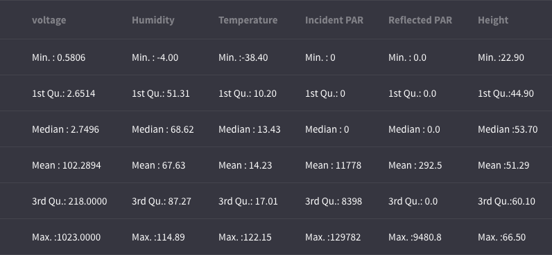
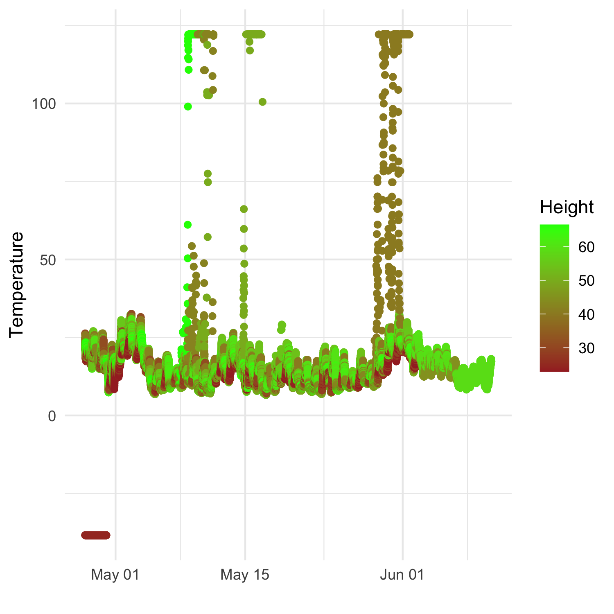
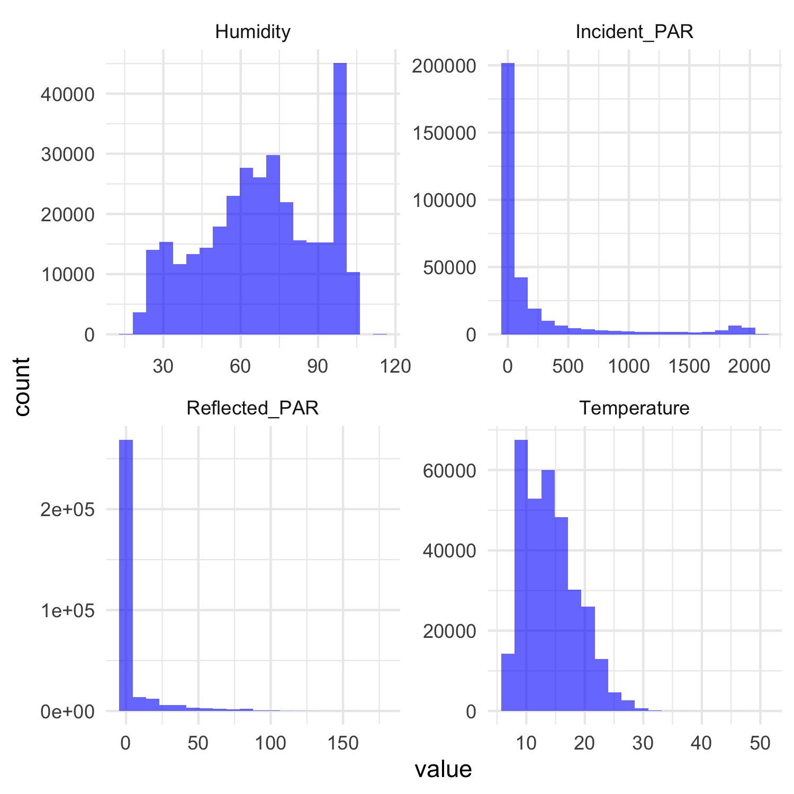
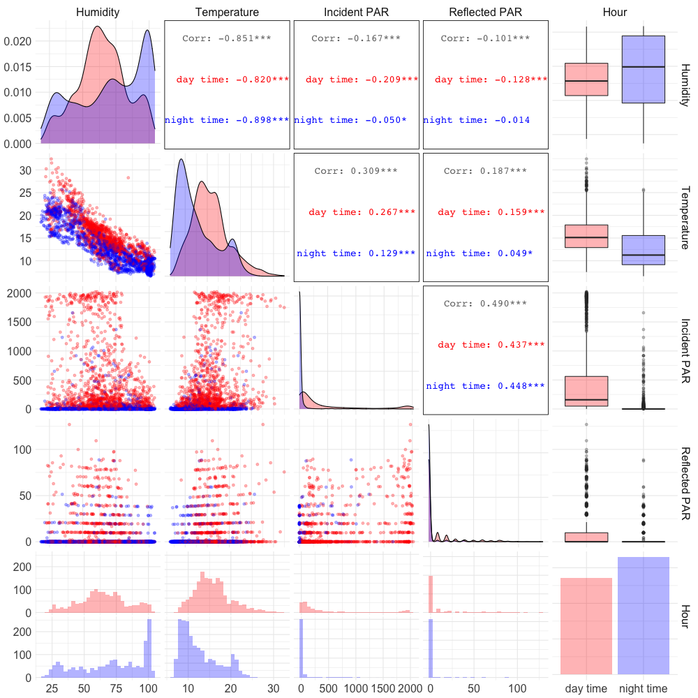
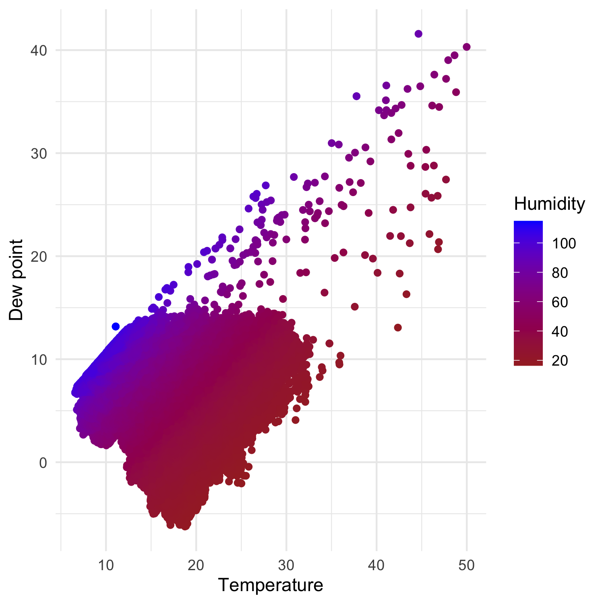
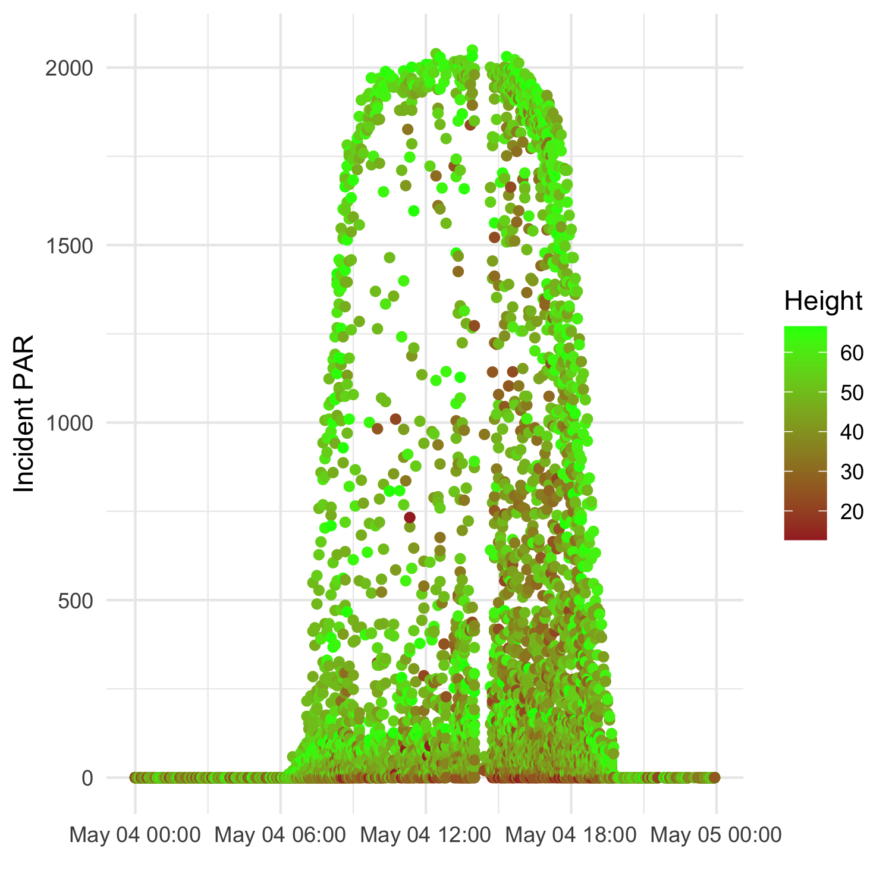
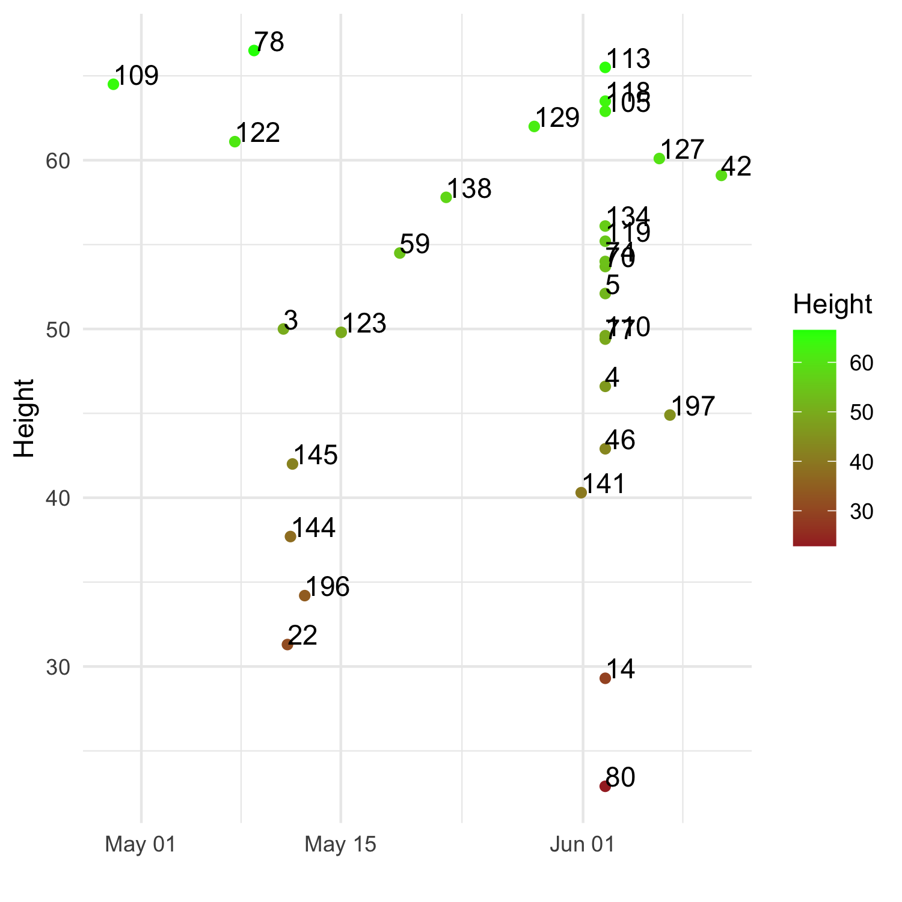
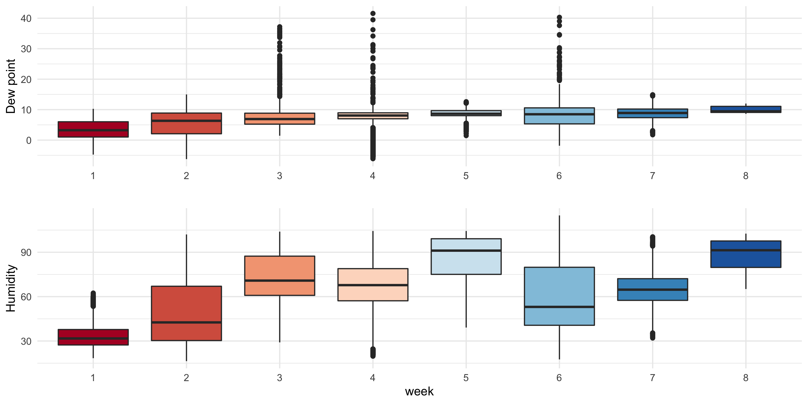
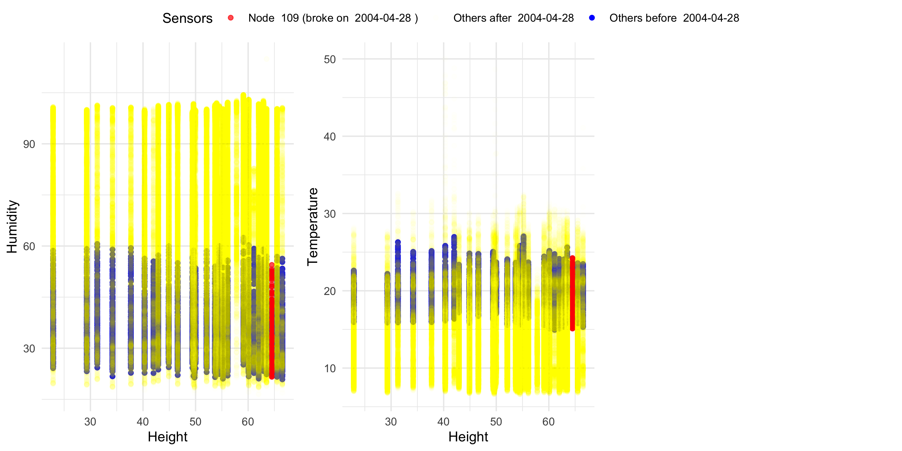
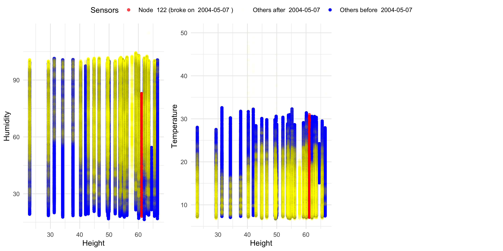

```{r}
a == b
```

# Introduction

On this lab we will explore the redwood data, which consists mainly of measurements of four variables humidity, temperature, direct and reflected photosynthetically active radiation (PAR). The novelty on this data is that is was collected using state of the art methods (at the time) and the intention was to confirm biological knowledge regarding the variation of the microclimate over the volume of a redwood tree.  
Studying and understanding ecological systems is one of the oldest class of problems that scientists been working on. As we are also part of the ecological system it is very natural for us to seek a better understanding our environment. Possible implications of of better understanding may relate to the field of agriculture where we could obtain to knowledge on how to grow more types of plats. As well as to understand how future action and climate changes may affect the redwood trees.  
Trees photosynthesis process is of major importance to us as human beings as we rely on the oxygen produced on this process, that gives us motivation as well to study trees.
We assume on this analysis that the data collection method is reliable when no significant evidence suggesting otherwise is there, in statistical terms you may refer to this as the null hypothesis.  
Our data analysis will focus on finding anomalies and provide some critique to the analysis done in the paper, on the first part we will revisit the data cleaning and outliers detection process and on second part we will look in a single sensor in more detail.

<!-- Things to potentially include in your introduction: -->

<!-- - Describe the premise of your exploratory data analysis and put your analysis in the domain context -->
<!-- - Explain why studying this redwood data interesting and/or important -->
<!-- - What are the implications of better understanding this data? -->
<!-- - What is the purpose of your exploratory data analysis? -->
<!-- - Outline what you will be doing in the rest of the report/analysis -->

# Data

We will be look at the four main measurements: relative humidity, temperature, incident and reflected PAR let us describe each variable in more detail:  

* Relative humidity (RH) - tells us how much water vapor is the air, compared to how much it could hold at a given temperature.  
The units of RH are percent (range 0-100) as it is the quotient of two partial pressure variable when the latter is always bigger than or equal to the former.  
The importance of relative humidity lies in it's relation to transpiration, which is a process of water movement through a plant and its evaporation for aerial parts i.e leaves stems and flowers.
Relative humidity measurements are taken to be fed into transpiration models as we know that higher RH decreases the rate of transpiration since the water gradient from the tree to it's surrounding decreases (outside is closer to saturation so can't take more water).  

* Temperature - a physical quantity that expresses hot and cold. 
The units we measure temperature are celcius, the range is not limited, the freezing point is 0 and the boiling point is 100.
The temperature is measured, similar to RH to be fed into transpiration models, as temperature affect the transpiration process in that high temperatures may increase the loss of water to the plant.  
As mentioned before temperature and RH are tightly related as can be illustrated by in the figure (taken from Wikipedia):  

{width=50%, height=50%}

* Incident (direct) PAR - it is a measure of the spectral range of solar radiation that photosynthetic organisms are able to use in the process of photosynthesis. We would expect to be high when the sun is out and low when the sun is down roughly speaking.  
It is reported in the paper in units of $\mu$col/$m^2$/s which is how many molecules we see in a squared meter per second and it provides an indication into the energy available for photosynthesis.  
As photosynthesis is a process of major importance, and has been well studied it is important that new measurement tools would pass the reality check of what we already know about this process.


<!-- - What is the data that you will be looking at? -->
<!-- - Provide a brief overview of the data -->
<!-- - How is this data relevant to the problem of interest? In other words, make the link between the data and the domain problem -->

## Data Collection

The data collection was done using sensors that were placed along the tree trunk starting at 15m from ground level up to 70m with 2m spacing between the nodes. Most of the nodes were placed on the west side of the tree.
The measurements of temperature and RH are pretty straight forward and are reported in celcius and percentages respectively as for PAR it seems that the units of the measurements we were provided with are lux for reasons I will elaborate on later.

<!-- - How was the data generated? -->
<!-- - Discuss the measurements of each variable in the data that you will be using in your analysis -->

## Data Cleaning

* Removed missing values - due to time considerations I removed all na's this is sub-optimal but tailoring a solution to complete those values seemed like a difficult task. 
* Merging dates with node location data one particular date appeared in too many measurements so correcting the dates using the location data fixed this issue, some duplicates were removed as well in that process.  
* Exclude our analysis to the interior tree since by comparing the heights of those nodes to the ones stated on the paper it seems reasonable that the paper looked at those as well.  

Now we take a look at some descriptive statistics:  
{width=50%, height=50%}

We can already note some bizarre values: 


* Humidity -  Values should be with 30-100 range according to http://www.weather.gov.sg/climate-historical-extremes-humidity/ we'll remove any value outside of this range  

* Temperature - ground level temperatures in California should drop below zero, as those trees can be high before excluding such values we should do a temperatures vs height of node plot to make sure. 

* PAR - The values seems to large to be in units of $\mu$mol/$m^2$/s after looking online I figure out that whose are lux units, to obtain the same range as the paper we divided by 54 (https://www.apogeeinstruments.com/conversion-ppfd-to-lux/).  

Observing the temperature across time across the height of the sensor shades some light on the nature of the outliers:


{width=40%, height=40%}


We decide to remove temperature above 40 and below 0 as they are very rare in California based on historical weather data https://www.weather-us.com/en/california-usa/sonoma-climate?c,mm,mb,km#climate_text_12.

{width=40%, height=40%}


## Data Exploration

Here we would look at relationships between variables, conditioning on day time (6-18) and night time (18-6)

{width=60%, height=60%}

few interesting things to take from this plot:  
1. The distribution of all variables are not independent from the binary variable day time / night time  
2. The correlation between humidity and temperature remains, the marginal distributions are shifted  
3. Both PAR variables do not show particular trends with humidity and temperature, maybe the higher values are restricted to a range of temperature/humidity.  

## Reality Check

- It makes sense to test the joint distribution of both humidity and temperature as those variables are closely related, the range of dew point which is a function of both might serve as a good indicator

{width=40%, height=40%}

- Another good reality check is to validate the our times are aligned with what we know about sunrise and sunset

{width=40%, height=40%}


# Graphical Critique

- With regard to figure 3 I feel that the use of boxplot is a bit of an overkill in this case, for me it would look much nicer to use a line indicating the trend with and indication for standard deviation that would indicate the variability I don't learn much more from observation so many outliers points.    
- From a statistical point of view I would expect the author to address the node at height 64.5 whose distribution in humidity and temperature is different from all the other nodes.  
- As to figure 4, in the radiation figure I think that the blue lines are redundant as the trend is already clear enough.   
- I was also expecting to see a seasonal trend analysis that I feel is would be interesting as well.  

# Findings


## First finding - broken node indicates seasonal trend

I was interested to understand why temperature and humidity measurements was so different for the node at 64.5 meters (node id 109), as it turns out this node breaks on April 28th, the seasonal trend accounts for the difference in distribution

{width=40%, height=40%}

looking at this behavior you have to be critical of the paper mean reduction analysis that made the assumption of i.i.d observations when strong evidence suggesting otherwise were present.


## Second finding - do nodes break randomly


Bearing in mind the affect of seasonal trend on our data we would also like to understand how many nodes have also failed mid-experiment  

{width=40%, height=40%}

## Third finding - intuitive seasonal trend for humidity and temperature

The previous finding motivated me to explore the seasonal trend further, on their figure of seasonal trend the humidity and temperature is not in accordance for our intuitive correlation between humidity and temperature

{width=40%, height=40%}


## Stability Check

I would want to look again at the first finding and ask if happens if we were to change the node we were looking at, using our second finding we can recreate the analysis for node 122

{width=40%, height=40%}
{width=40%, height=40%}
Our analysis is a bit superficial as we are observing only the range of values until time t which is monotonically increasing with t (similar to filteration of sigma algebras), so the perturbated example difference is not as vivid (the original one was the first to break), but still looking at the temperatures I feel that the seasonal trend is present.

# Discussion

- Data size: I didn't experience any challenges related to data size, after cleaning I had 320320 measurements on my dataset and I was able to perform every analysis I wanted, the only place I had a problem was with the ggpairs plot where I sub-sampled the data randomly.  
- Three realms: Working on this lab I feel that I was for the most part in the data reality realm I spent most of my time trying to understand the variable and their interactions in the real world. I relied on my statistical intuition to critique the figure and detect odd things on a distribution level and understanding the assumption in the analysis for example that taking averages over time series data without accounting for seasonal trend is not the best idea.  
- Correspondence to reality: tree biology is not my domain of expertise, but I did try to make sense of the data through external validation in my case it was using the paper as a reference, common sense regarding sunrise and sunset and lastly historical weather data. To the best of my understanding the four main variables had a strong correspondence with reality.

# Conclusion

My analysis was mainly focused on the time series nature of the redwood data, motivated by odd statistics I've noticed on the paper as well as the fact the seasonality was not addressed enough in my opinion.  
A possible reason for that is that the experiment was not long enough to a include a full season cycle (year), which makes any seasonality analysis based on this data partial.  
I do feel like I have learned a lot about trees and that working on this real data with many domain related inconsistencies really highlights the importance of understanding the domain question as well the statistical side which I felt in this work was best reflected in my first finding.

# Academic honesty statement

Bin,   
I state that this work is my own and that I have not copied or cheated in any way.  
Honesty is an important value to me in and out of academia which I try to live by.  
In the context of academic work I feel that cheating is not something that serves the cheater in the long term which is another good reason to aviod it.
