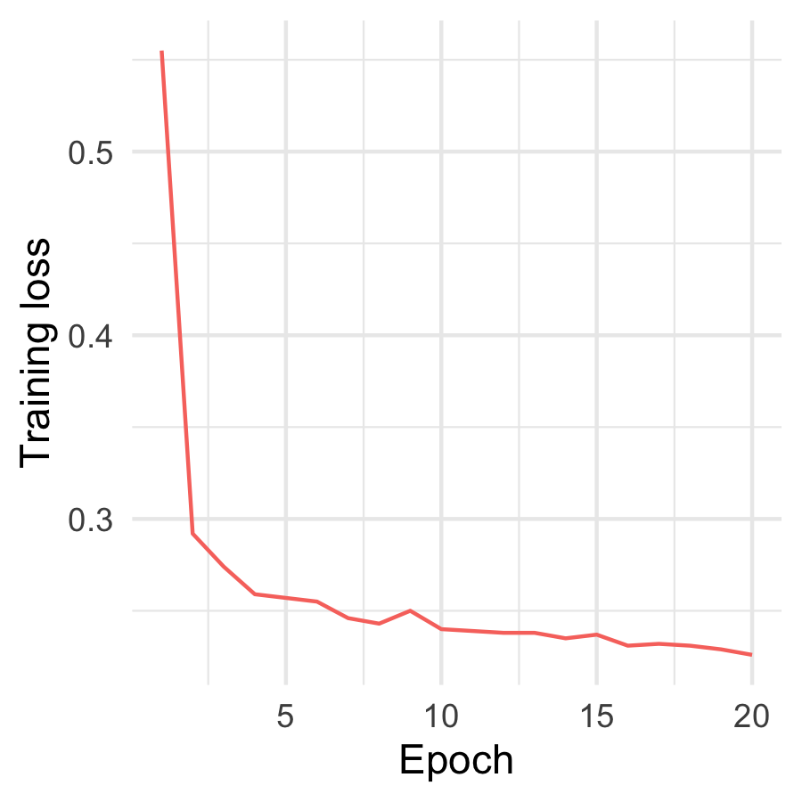

```{r setup, echo = FALSE, message=FALSE, warning=FALSE}
# load in useful packages
library(tidyverse)
library(ggpubr)
library(viridis)  
library(randomForest)
library(ggfortify)
library(here)
library(gridExtra)
library(caret)
library(MLeval)
library(GGally)
library(tidymodels)
library(kableExtra)
library(cowplot)
library(knitr)
# set default knitr chunks
knitr::opts_chunk$set(
  echo = FALSE,  # don't print the code chunk
  warning = FALSE,  # don't print warnings
  message = FALSE,  # don't print messages
  fig.width = 7,  # set default width of figures
  fig.height = 4,  # set default height of figures
  fig.align = "center",  # always align figure in center
  # fig.pos = "H",  # always plot figure at the exact location of the code chunk
  dpi = 300,
  cache = TRUE)  # cache results
source('R/utils.R')
source('R/split_data.R')
source('R/analyze_metrics.R')
source('R/train_rf.R')
source('R/DL_Model.R')
source('R/eda.R')
source('R/train_logit.R')

```

# Introduction
Global warming is an undeniable phenomenon and it is happening at an increasing rate. To build highly accurate global climate models, we need a better understanding of the dependency of the Earth's surface air temperatures and the atmospheric carbon dioxide levels. One way to understand this dependency is through analyzing cloud coverage, especially at the Arctic where the dependency is predicted to be the strongest. However, cloud detection on Arctic satellite images is particularly challenging due to similarities in characteristics of cloud-, snow- and ice-covered surfaces in the Arctic. Therefore, the goal of this project is to develop accurate cloud detection algorithms using data from Multi-angle Imaging SpectroRadio (MISR). In this project, we will first analyze the relationship between radiance features and engineered features from @shi2008daytime, then implement three classifiers: Logistic Regression, Random Forest and Neural Network and analyze the result of the best performed classifiers. 
```{r load-data}
# load in raw image data
img_files <- list.files(path = 'data', pattern = '.txt')
imgs <- loadData('data', img_files)
```

# Data Description
The data used in this report is three images collected from MISR. Each pixel in the images is labeled with its `x` and `y` coordinates, categorical cloud indicator (no cloud = -1, unlabeled = 0, and cloud = 1), three engineered features (`NDAI`, `SD` and `CORR`), and radiance features(`DF`, `CF`, `BF`, `AF` and `AN`). The radiance features are essentially the radiance received by satellite cameras at different zenith angles: 70.5°(`DF`), 60.0°(`CF`), 45.6°(`BF`), 26.1°(`AF`) in the forward direction; 0.0°(`AN`) in the nadir direction. `NDAI` stands for Normalized Difference Angular Index, which is the normalized difference of the means of `DF` and `AN`. `SD` is the standard deviation of MISR nadir camera pixel values across a scene. `CORR` is the correlation of MISR images of the same scene from different MISR viewing directions. The categorical cloud indicator is hand-labeled by domain experts and will serve as the ground truth in our analysis. Since unlabeled pixels provide no information to help us evaluate our models, we exclude them and make our data with only binary classes (no cloud = -1, cloud = 1).


# EDA

We first visualize the raw data to get a general picture of the images (Figure 1). Again, even though here we present all pixels but since the unlabeled pixels would not contribute to the cloud prediction, we exclude the unlabeled pixels in the following analysis. Note that the three now binary-labeled (no cloud / cloud) images will serve as the ground truth throughout the analysis. 

```{r plot-image, fig.cap='Plots of expert labeled pixels'}
# plot the x-y coordinates of pixels
ggplot(imgs, aes(x, y)) +
  geom_tile(aes(fill = truth)) +
  facet_wrap(img_name ~.) +
  scale_fill_viridis(discrete = TRUE) +
  labs(fill = 'Expert label') +
  theme_void() +
  theme(legend.position = 'top')
```


## Features Correlations
```{r features correlation, fig.cap='Correlations of the eight features: SD, CORR, NDAI, DF, CF, BF, AF, AN of the data', cache = TRUE}
# filter out the unlabeled pixels
labeled_img <- imgs %>% filter(truth != 'unlabeled')

# sample data units
set.seed(7)
sample_idx <- sample(1:nrow(labeled_img), 1000)
eda_imgs <- labeled_img[sample_idx, ]
cloud_labels <- factor(eda_imgs$truth)

# plot features correlations
ggpairs(eda_imgs, mapping = ggplot2::aes(color = truth), 
        columns = c('sd', 'corr', 'ndai', 'df',
                    'cf', 'bf', 'af', 'an'), 
        lower = list(
          continuous = wrap('points', alpha = 0.5, size = 0.2),
          combo = wrap('dot', alpha = 0.4, size = 0.2)),
        upper = list(continuous = wrap("cor", size = 2))) +
  theme_bw() +
  theme(strip.switch.pad.grid = unit(0, 'cm'),
        panel.spacing = unit(0,'cm'),
        axis.ticks = element_blank(),
        axis.text = element_blank(),
        panel.grid.major = element_blank(), 
        panel.grid.minor = element_blank()) +
  scale_fill_viridis(discrete = TRUE, begin = 0, end = 0.5) +
  scale_color_viridis(discrete = TRUE, begin = 0, end = 0.5)


```

We next look at the relationships of the features in the data, and try to figure out which features are the most representative for cloud / no cloud separation. After plotting the correlation of the features in Figure 2, we can observe the following trends: 

1. The three engineered features `SD`, `CORR` and `NDAI` are approximately negatively correlated with the radiance. 

2. The radiance are not only positively but also highly correlated with each other. In addition, the correlation between the radiance is higher when a pair of radiance has similar angle, like `DF` and `CF` or `AF` and `AN`. 

3. The separation of the no cloud and cloud classes is more distinct in the three engineered features and `AN`. If we would like to further rank them by the degree of separation of the two classes, the ranking would be `NDAI` > `SD` > `CORR` > `AN`.

## Principle Component Analysis
```{r pca, fig.cap='First two principle components and features correlation and contributions to top two principle components'}
# factorize the truth labels in data
labeled_img$truth <- factor(labeled_img$truth, labels = c('no cloud', 'cloud'))

# run PCA on data
pca_out <- prcomp(labeled_img %>%
                    select(-c(truth, img_name)) %>%
                    rename_with(~ toupper(.x)),
                  center = T,
                  scale = T)

# plot PCA directions
autplot_data <- labeled_img %>% select(-c(img_name, x, y))
autplot_data$truth <- as.factor(autplot_data$truth)
autoplot(pca_out,
         data = autplot_data,
         colour = 'truth',
         loadints = TRUE,
         loadings.colour = 'black',
         alpha = 0.5,
         size = 0.2,
         frame = TRUE,
         frame.type = 'norm',
         loadings.label = TRUE,
         loadings.label.size = 2.5,
         loadings.label.vjust = -1) +
  scale_color_viridis(discrete = TRUE) +
  scale_fill_viridis(discrete = TRUE) +
  labs(color = 'Expert Label', fill = 'Expert Label') +
  geom_hline(yintercept = 0, lty = 2) +
  geom_vline(xintercept = 0, lty = 2) +
  theme_minimal() +
  theme(panel.grid = element_blank(), 
        panel.border = element_rect(fill= "transparent"),
        legend.position = 'top')

```

We look deeper into the relationships between features using the Principle Components Analysis (PCA). Since the features have different values scales, we center and scale before performing PCA. In addition, since using different subsets of data will result to different plots of PCA, we use all labeled data to perform PCA to have a broad understanding of the data. In Figure 3, the ellipses represent 95% concentrated level between cloud and no cloud groups. From the figure, we can also see the relationships between all features: `CORR`, `SD`, and `NDAI` are positively correlated with each other and negatively correlated with radiance features. This observation matches with the observations we find using the correlation plots. The arrows also indicate the contributions of each feature to the top two principle components. For example, features `AF` and `AN` contribute largely to the first component while features `DF` and `CORR` have large contributions to the second principle component. 

## Features Heatmap
We know that `SD`, `CORR` and `NDAI` are calculated from other radiance features hence will contain information of other features. From the features correlation analysis and PCA results, we know `SD`, `CORR`, `NDAI` and `AN` are the most representative features to separate the no cloud and cloud classes. We next look deeper into the spatial relationships of the features through exploring their heatmaps. In Figure 4, we show the heatmaps generated from image 3 as an example. Comparing with the ground truth of image 3, we can see the features indeed captured certain information of the ground truth. In addition, the four features' ability to capture image information can be ranked roughly as `NDAI` > `AN` > `SD` > `CORR`.

```{r features heatmap, fig.cap='Heatmaps of features: NDAI, AN, SD and CORR, with ground truth aside for easier comparison', cache = TRUE}
# plot features heatmap for:
# NDAI
ndai_heatmap_plt <- plotNadi('image3.txt', imgs) +  
  theme(legend.position = 'none') 

# AN
an_heatmap_plt <- plotAN('image3.txt', imgs) + 
  theme(legend.position = 'none')

# CORR
corr_heatmap_plt <- plotCorr('image3.txt', imgs) + 
  theme(legend.position = 'none')

# SD
sd_heatmap_plt <- plotSd('image3.txt', imgs) + 
  theme(legend.position = 'none')

# plot gt image
img_plt <- plotImage('image3.txt', imgs) +
  theme(legend.position = 'none')

ggarrange(ndai_heatmap_plt,
          an_heatmap_plt,
          sd_heatmap_plt,
          corr_heatmap_plt,
          img_plt, 
          legend = NULL, nrow = 1)

```

# Data splitting
Since the pixels are spatially correlated with each other, we use the entire image 2 as the testing set to ensure no information of the testing data leaked into the training data. For cross validation, preferably, we would like to have each cross validation fold is a set of images. However, we only have 2 images for training data. Therefore, we decide to cut image 1 and 3 into 4 smaller images on the vertical axis. Each smaller image will be a cross validation fold. This method does not completely prevent the leaked spatial information between folds but minimizes the impact of the spatial relationship between pixels in the same image on training performance. 

# Most Importance Features
```{r}
# =========================================
# to split the data again run 
# train_data <- splitData(imgs)
# =========================================
# load train & test split data to ensure having the same fold assignments
train_data <- read.csv('data/train_test_split_1.csv')
```

Even though PCA analysis gives us how features contribute to the top principle components of the data, the result is inconsistent with different subsamples. Hence, we decide to use random forest model to find the top important features and have stronger support evidence for the top important features. Random forest model does not involve any assumption besides the sample data is representative. To ensure the assumption, we subsample 80% of training data and run Random Forest model for 5 times to obtain feature importance and top 3 most important features by ranking are `NDAI`, `SD` and `AN`. This result is consistent with our analysis on feature correlation earlier. The feature importance from Random Forest model is calculated by the average decrease in Gini index over all decision trees and Gini index is the measurement of node impurity from splitting on the variable. 
```{r}
# select train data: image 2
train_data_image2 <- train_data %>% 
  filter(dataset2 == 'training' & truth != 'unlabeled')
train_data_image2$fold <- factor(
  as.numeric(factor(train_data_image2$img_sec)))
train_data_image2$truth <- factor(
  train_data_image2$truth, labels = c('cloud','no_cloud'))
```

```{r feature importance image2, eval= FALSE}
# run rf to find feature importance
rf_important_vars <- sapply(1:10,
                            FUN = extractFeatureImportance_RF,
                            0.8,
                            train_data_image2, 3)

# put the result in a table
table(rf_important_vars)
```

# Classifiers
Here we introduce the three classifiers used in our analysis. We also discuss the training process of the models and how we tackle with their model assumptions.

## Logistic Regression Model
Logistic Regression model is often used when the outcome is a two-level categorical variable, like the no cloud or cloud classes we are predicting. Logistic Regression is a type of generalized linear model, and can be essentially think of as a two-stage modeling approach. In other words, we first model the response variable with binomial probability distribution, and then we model the parameter of the distribution using a set of predictors and a logit transformation. We train the Logistic Regression model with cross validation with assigned folds.

There are two main assumptions for Logistic Regression to work:

1. Linear relationship between predictors and log-odds.

2. Correlated predictors can inflate variance and bias of coefficients.

We explore the relationships between the three predictors (`NDAI`, `SD` and `AN`) and the log probability of the cloud prediction to test the first assumption. We found empirically from several training trials that the relationships of the three features and the log-odds are only linear under this condition: `NDAI` less than or equal to 1.5, `SD` less than or equal to 5, and `AN` in the range of 175 to 225. So we restrict our data for the three features to be within the ranges to meet the assumption when training the logistic regression model. We demonstrate the linear relationships of the three features and log-odds in Figure 5. The negative relationship of `AN` and log-odds makes sense since it's natural to think if there's cloud then the radiance received by the satellite camera in the `AN` direction should be blocked.

```{r define-features}
# define train features
train_features <- c('truth','ndai','sd','an')

# get test set
test_data_image2 <- train_data %>% 
  filter(dataset2 == 'testing' & truth != 'unlabeled') 
test_data_image2$truth <- factor(
  test_data_image2$truth, labels = c('cloud','no_cloud'))
```

```{r logit_model}
# To meet the model assumption,
# we need to revise the training data
# a bit for logitic model
train_data_image2_rev <- train_data %>% 
  filter(dataset2 == 'training' &
           truth != 'unlabeled' & 
           ndai <= 1.5 &
           sd <= 5 &
           an >= 175 &
           an <= 225)
train_data_image2_rev$fold <- factor(
  as.numeric(factor(train_data_image2_rev$img_sec)))
train_data_image2_rev$truth <- factor(
  train_data_image2_rev$truth, labels = c('cloud','no_cloud'))

# =======================================
# to train the logistic regression model,
# we can run this code
logit_model <- trainLogitmodel(train_data_image2_rev, train_features)
# ========================================

# load model
# logit_model <- readRDS("rev2_logit_model_image2_3vars.rds")
logit_pred <- predict(logit_model, test_data_image2, type = 'prob')

```

```{r logit assumption test-1, fig.cap='Assumption test of Logistic regression: relationships between predictors and log-odds'}
# assumption 1 test:
# features vs log-odds linear relationship
pred_covaraites_df <- data.frame(logit_pred$cloud, 
                                 test_data_image2[, c('ndai', 'sd', 'an')])

# sample data units
set.seed(7)
sample_idx_2 <- sample(1:nrow(pred_covaraites_df), 500)
sampled_pred_covariates_df <- pred_covaraites_df[sample_idx_2,]

# x-y plot for features and log-odds
log_odds <- log(sampled_pred_covariates_df[, 1])
NDAI <- sampled_pred_covariates_df$ndai
SD <- sampled_pred_covariates_df$sd
an <- sampled_pred_covariates_df$an
p1 <- qplot(NDAI, log_odds
      , geom = 'smooth', span = 0.5
      , xlab = "NDAI", ylab = "Log(probability of cloud prediction)"
      , xlim = c(min(NDAI), 1.5))+ theme_bw()
p2 <- qplot(SD, log_odds
      , geom = 'smooth', span = 0.5
      , color = I("red")
      , xlab = "SD", ylab = "Log(probability of cloud prediction)"
      , xlim = c(min(SD), 5))+ theme_bw()
p3 <- qplot(an, log_odds
      , geom = 'smooth', span = 0.5
      , color = I("green")
      , xlab = "AN", ylab = "Log(probability of cloud prediction)"
      , xlim = c(175, 225))+ theme_bw()
ggarrange(p1, p2, p3, nrow = 1)
```

Next, for assumption two, we would like to investigate whether correlated predictors can inflate variance and bias of the coefficients. To test this assumption, we add in the radiance features, in addition to the three engineered features, to train a logistic model. Since we know the radiance is highly correlated with each other, as demonstrated in the EDA section, the predictors in the model are correlated. We compare the variance of this model with our original logistic model trained with only three features in Table 1, and find the variances of the coefficients of `NDAI`, `SD` and `AN` indeed inflate after adding the correlated predictors to our model. Hence, assumption two is also fulfilled in our logistic model.

```{r logit assumption test-2, cache = TRUE}
# assumption 2 test:
# inflated variance and bias of coefficients
sd_3vars <- list(ndai = 0.03735, sd = 0.02140, an = 0.02077)
sd_8vars <- list(ndai = 0.04276, sd = 0.02408, an = 0.14465)

# turn the variance into scientific notation
sd_df <- data.frame( NDAI = c(1.40, 1.83),
                     SD = c(4.58, 5.80),
                     AN = c(4.31, 209))
row.names(sd_df) <- c("original logistic model", "correlated logistic model")
colnames(sd_df) <- c("NDAI (e-03)", "SD (e-04)", "AN (e-04)")
kable(sd_df, caption = "Comparison of the variance of the coefficients")
```

## Random Forest
A decision tree is a building block of Random forest model. In a decision tree, at each node, a condition on a feature to split the data to left or right branch is implemented. In the end, the decision tree will provide the class in which the data is most likely belong to. A random forest model consists a large number of decision trees and the final class for a data point will be the one with the most number of votes. We have two assumptions for random forest model to run well:

1. There must be some signals in the features so the model can pick up and perform better than just random guessing.

2. The predictions made by the individual trees have low correlations with each other. 

The first assumption is safe to make since even when snow- or ice-covered surfaces look similar to cloud on image, snow, ice and cloud are different materials and hence would reflect different levels of light radiance. To ensure the second assumption, Random Forest uses both bootstrap aggregation method which allows each decision trees to randomly sample from the dataset with replacement and feature randomness which allows individual trees choosing features to split from a random subset of features. 
```{r rf_model}
# ====================================
# to train the RF, we can run this code
rf_model <- trainRFmodel(train_data_image2, train_features)
# =====================================

# load model
# rf_model <- readRDS("model_image2_3vars.rds")

rf_pred <- predict(rf_model, test_data_image2, type = 'prob')
```

## Neural Network
We used a feed forward Neural Network as a classifier to predict the cloud/no cloud label. The architecture includes three hidden layers with 30 neurons and softmax output. The model was trained using the features: `NDAI`, `SD`, `CORR`, `DF`, `CF`, `BF`, `AF`, `AN`. We trained for 20 epoches with batch size 240 using Adam optimizer (default learning rate) and binary cross entropy loss. The chosen architecture defines a family of parametric distributions of the label given the features.. We assume that after the training process is complete the distribution we get is a good approximation of the distribution of the data.

It is rather hard to validate this assumption, looking at how the predictions compared with other methods we can probably say that the assumption does not hold but provides a reasonable approximation.   

```{r nn_model}
# train Neural network model and get prediction on all pixels
nn_pred <- predictCloudProb(imgs)
# combine n  pred with truth
nn_pred_df <- data.frame(truth = imgs[imgs$img_name == 'image2.txt', 
                                      c('x','y','truth')],
                      nn_pred = nn_pred)
colnames(nn_pred_df) <- c('x','y','truth','nn_pred')
```

# Model Evaluation
```{r evaluation metrices, fig.cap='ROC curve and PR curve of Logistic Regression, Random Forest, Deep Learning models' }
#fig.height=4, fig.width=8
# combine prediction probability
# of the three classifiers
combine_pred <- data.frame(truth = test_data_image2$truth, 
                           rf_pred = rf_pred$cloud,
                           logit_pred = logit_pred$cloud,
                           nn_pred = nn_pred_df$nn_pred[
                             nn_pred_df$truth != 'unlabeled'])

# convert to long format
combine_pred_long <- combine_pred %>% 
    pivot_longer(-truth,
                 names_to = 'model_type',
                 values_to = 'cloud_prob')
combine_pred_long$model_type <- factor(
  combine_pred_long$model_type, labels = c('Logistic Regression',
                                             'Deep Learning',
                                             'Random Forest'))
# plot ROC and PR curves
roc_pr <- plotROC_PRcurve(combine_pred_long)
ggarrange(roc_pr$roc_plot, roc_pr$pr_plot, common.legend = TRUE)

```

```{r spider plot, fig.cap='Radar plot to compare all three models performance'}
#fig.height=4.5
metrics_df <- calculateMetrics(thres = 0.5,
                               combine_pred_long,
                               roc_pr$roc_pr_df)
# write.csv(metrics_df, 'data/metrics_df.csv')
# plot metrics
plot.spider(combine_pred_long)

```

After evaluating and comparing the performance of Logistic Regression, Random Forest, and Deep Learning Neural Network model, we decide to choose Deep Learning Neural Network model as the final model. The reason for the decision is based on the metrics ROC AUC and PR AUC. Even though Logistic Regression model has the highest corners in both ROC and PR curves plots (Figure 6), the areas under the ROC and PR curves of Deep Learning model are the largest. Since we train our model on a very limited dataset, we want to ensure the generality of the models so the model would also perform well on future data. The area under the curve is a more general metric to evaluate a classification model since it is calculated over different probability threshold unlike the other metrics where we use 50% as the threshold. Therefore, although Logistic Regression also has the highest values for Recall, F value and Balance Accuracy (Figure 7), we still favor ROC AUC and PR AUC metrics and choose Deep Learning model. Random Forest performance is the combination of both Deep Learning and Logistic Regression models that has second highest values in all metrics. With the same reason to ensure the generality of the model, we would still prefer Deep Learning model over Random Forest. 

# Post-hoc EDA of Deep Learning Neural Network Model

## Training analysis  
The first thing to inspect is the convergence of gradient decent in training to assume we have reached a local minima  

```{r  out.width = "30%", fig.cap='Training loss value along training epochs'}
 
```

```{r prediction image, fig.cap = '1. Heatmap of Deep Learning model probability prediction for cloud; 2. Deep Learning prediction on all pixels; 3. Deep Learning prediction on labeled pixels; 4. Original image' }
# combine prediction and truth values
# get unlabeled pixels

unlabeled_data <- train_data %>% filter(dataset2 == 'testing' & 
                                          truth == 'unlabeled',) %>%
  mutate(nn_pred = truth) %>%
  select(truth, nn_pred, x, y)

# nn_pred_all = ifelse(nn_pred >= 0.5, 'cloud', 'no_cloud'),

# add in predicted pixels
truth_pred_df <- cbind(combine_pred %>% select(nn_pred, truth), 
                       test_data_image2[, c('x','y')]) %>%
  # convert prediction prob to classes
  mutate(nn_pred = ifelse(round(nn_pred), 'cloud', 'no_cloud')) %>%
  rbind(unlabeled_data) %>%
  pivot_longer(-c(x,y), names_to = 'model_type', values_to = 'prediction')

truth_pred_df <- rbind(truth_pred_df, 
                       nn_pred_df %>%
                         mutate(model_type = 'DL on All',
                                prediction = ifelse(nn_pred >= 0.5, 
                                                    'cloud', 'no_cloud')) %>%
                         select(x,y, model_type, prediction))
truth_pred_df$model_type <- factor(truth_pred_df$model_type,
                                  labels = c('DL on All',
                                             'Deep Learning',
                                             'Truth'))

pred_prob_heatmap <- ggplot(nn_pred_df, aes(x,y)) +
  geom_tile(aes(fill = nn_pred)) +
  scale_fill_viridis(discrete = FALSE) +
  theme_void() +
  labs(fill = 'Cloud Probability', title = '') +
  theme(legend.position = 'top',
        plot.title = element_text(size = 5))
  

# plot the prediction images
pred_truth_plot <- ggplot(truth_pred_df, 
                          aes(x, y)) +
  geom_tile(aes(fill = prediction)) +
  facet_grid(. ~ model_type) +
  scale_fill_viridis(discrete = TRUE, 
                     labels = c('cloud', 'no cloud', 'unlabeled')) +
  theme_void() +
  labs(fill = 'Labels') +
  theme(legend.position = 'top') 
  
heatmap_legend <- get_legend(pred_prob_heatmap)
pred_legend <- get_legend(pred_truth_plot)
first_row <- plot_grid(heatmap_legend, pred_legend, 
                       rel_widths = c(0.7,1), nrow = 1)
plot_grid(first_row,
          plot_grid(pred_prob_heatmap + theme(legend.position = 'none'), 
                    pred_truth_plot + theme(legend.position = 'none'),
                    rel_widths = c(0.33,1)),
          nrow = 2, rel_heights = c(0.12,1))
```

Figure 8 and Figure 9 show that Deep Learning model depends heavily on `NDAI` features and it often predicts unlabeled pixels as cloud following the heatmap of ndai closely.  

```{r post-hoc eda: features heatmap, fig.cap='The heatmaps of the three important features on the testing image', cache = TRUE}
# plot features heatmap for:
# NDAI
ndai_heatmap_plt <- plotNadi('image2.txt', imgs) + 
  theme(legend.position = 'none')
# AN
an_heatmap_plt <- plotAN('image2.txt', imgs) + 
  theme(legend.position = 'none')
# SD
sd_heatmap_plt <- plotSd('image2.txt', imgs) + 
  theme(legend.position = 'none')

ggarrange(ndai_heatmap_plt,
          an_heatmap_plt,
          sd_heatmap_plt,
          legend = NULL, nrow = 1)

```
Now excluding the unlabeled pixels, we look deeper into the feature distributions of the misclassified pixels. We further divided the misclassified pixels into type I and type II error groups, and compare them with the feature distribution of the whole testing set to see if we can observe any patterns. From Figure 10, we found the distributions of `NDAI` didn't differ much between groups, and that the classifier tended to misclassify the no-cloud pixel as cloud when `AN` is higher and `SD` is lower (the opposite for misclassifying the cloud ones as no-cloud).

```{r post-hoc eda: error pattern, fig.cap='Feature distributions of the testing set, type I error group and type II error group', cache = TRUE}
# pattern analysis for misclassified pixels
nn_combine_pred <- combine_pred[, c('nn_pred', 'truth')]
working_df <- cbind(nn_combine_pred, test_data_image2[, c('x','y')]) %>%
  # convert prediction prob to classes
  mutate(
         nn_pred = ifelse(round(nn_pred) == 1, 'cloud', 'no_cloud')) %>%
  rbind(unlabeled_data)

error_pred <- working_df %>% filter(truth != nn_pred)

features_df <- imgs %>% 
  filter(img_name == 'image2.txt') %>%
  select(ndai, sd, an, x, y)

# Type I error: false positive ; Type II error: false negative
error_df <- merge(error_pred, features_df, by = c("x", "y"))
error_long <- error_df %>%
  pivot_longer(-c(x,y,nn_pred,truth), names_to = 'feature_type', values_to = 'values') %>%
  mutate(error_type = ifelse(nn_pred == 'cloud', 'type I error', 'type II error'))
error_long <- error_long[, c('feature_type', 'values', 'error_type')]

features_long <- features_df %>%
  pivot_longer(-c(x,y), names_to = 'feature_type', values_to = 'values') %>%
  mutate(error_type = 'testing set')
features_long <- features_long[, c('feature_type', 'values', 'error_type')]

compare_error_long <- rbind(error_long, features_long)

# plot the data distribution of the
# misclassified pixels
ggplot(compare_error_long, aes(x = error_type, y = values, fill = feature_type)) +
  geom_boxplot() +
  facet_wrap(feature_type ~., scale = 'free') +
  scale_fill_viridis(discrete = TRUE, guide = FALSE) +
  xlab('') + ylab('') +
  theme_bw()
```

# Conclusion
